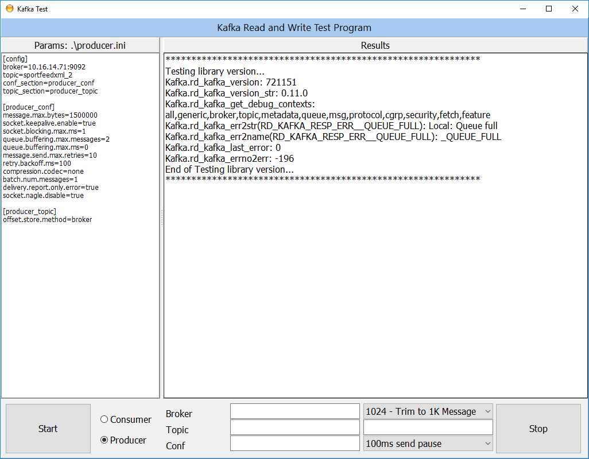

# KafkaGate

This library shows how to use Apache Kafka and FreePascal (CodeTyphon 6.0, Lazarus)
This is translation of librdkafka C library (and it contain ZeroMQ wrapper also). 
It contain examples for Win64 and Win32 (but it should be portable to Linux, etc..)
There are 2 ways how to write FreePascal Kafka application. 
One way is C procedural style, and the other one is Object Pascal Style.

KafkaPas is example how to create Kafka GUI application. 
KafkaGate is example how to create console application. This application is usefull if you want to connect ZeroMQ Socket and Kafka Topic. You can send and receive messages between them. 

ZeroMQ is excelent message queue library, but without broker (therefore you can lost message).
On the other hand Apache Kafka is message queue broker. So if you like ZeroMQ, but unfortunatelly you need some broker for your project, you can use Kafka to serve that purpose.

  
  

KafkaGate Console Menu

writeln('Menu');

writeln('1. Start consumer - C Style');

writeln('2. Start producer - C Style');

writeln('3. Start consumer - Pas Style');

writeln('4. Start producer - Pas Style');

writeln('KAFKA 2 ZEROMQ');

writeln('config_file: KafkaGate.ini');

writeln('Purpose of this pipeline is');

writeln('- put message to kafka->consume message from kafka->send message to 0mq->receive message from 0mq');

writeln('11. Start Kafka Producer');

writeln('12. Start Kafka Consumer -> Start ZEROMQ PUSH');

writeln('13. Start ZEROMQ PULL');

writeln('ZEROMQ 2 KAFKA');

writeln('config_file: KafkaGate.ini');

writeln('Purpose of this pipeline is');

writeln('- put message to 0mq->consume message from 0mq->send message to kafka->receive message from kafka');

writeln('21. Start ZERMOQ Producer PUSH');

writeln('22. Start ZEROMQ PULL -> Kafka Producer');

writeln('23. Start Kafka Consumer');

